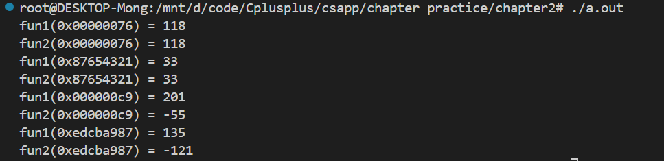
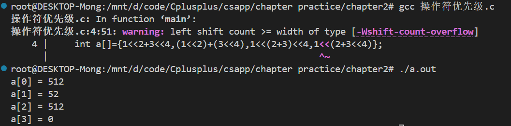
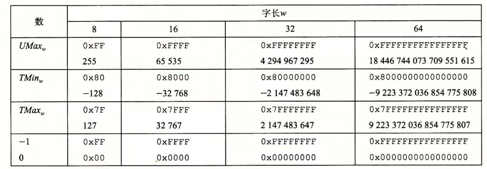
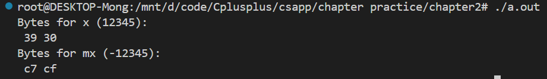

# csapp
CMU15213 CSAPP course files stored in Linux (WSL)

## CS:APP Docker and Materials

CS:APP is an excellent material for learning computer systems and systems programming. However, it is inconvenient to use a virtual machine for self-learners. 
In this repo, I build a Docker image with most pre-requistes installed and attached all lab materials in it.
You can directly use this Docker image [xieguochao/csapp](https://hub.docker.com/r/xieguochao/csapp).

The original materials of CS:APP is from CMU: [CS:APP labs](http://csapp.cs.cmu.edu/3e/labs.html). 

The code server is based on [https://github.com/cdr/code-server](https://github.com/cdr/code-server).

## How to Use It?

**Install Docker or Podman**

- [Docker Engine](https://docs.docker.com/engine/install/)
- [Podman](https://podman.io/docs/installation)

**Clone Repository**

1. `git clone --branch 1.8 https://github.com/XieGuochao/csapp.git`.
2. `cd csapp`.

**Build Image (Optional)**

1. `cd csapp-docker`
2. `docker build -t csapp .`.

 **Run**

Under the root directory.

`docker run -p 7777:7777 -v "$PWD/labs:/home/csapp/project" csapp`

Then you can access your labs via browser [http://localhost:7777/](http://localhost:7777/) with password `csapp`. You can find all files in `labs` under `/home/csapp/project`.

# 前言

在我看来csapp更像是一个c语言的基础教程，里面涉及了许多更底层的原理，比如为什么强制类型转化只是把解释类型的作用更换了，而其比特位不变？为什么`3<4<3`最后返回结果是`0`？负数的反码+1为什么等于反码？

这些都是CSAPP所涉及到的内容，不过由于时间关系我会省去一些控制流相关的章节，毕竟我们知道`if-else`,`switch`等都是需要逻辑完备的东西。底层细节的布尔代数就不再赘述。

# chapter2

## 小端，大端存储

```c
int val = 0x887654321;
byte_pointer valp=(byte_pointer) &val;
show_bytes(valp,1);
show_bytes(valp,2);
show_bytes(valp,3);
```
```tex
A:小端法21          大端法:87
B:小端法21 43       大端法:87 65
C:小端法21 43 65    大端法:87 65 43
```

## 逻辑运算

| 表达式 | 结果 |
| :----: | :--: |
|!0x41|0x00|
|!0x00|0x01|
|!!0x41|0x01|
|0x69&&0x55|0x01|
|0x69\|\|0x55|0x01|

只使用位级和逻辑运算，编写一个C表达式，它等价于x==y。换句话说，x和y相等时它讲返回1，否则就返回0

```c
return !(x^y);
```

## 位移运算

C 语言还提供了一组移位运算，向左或者向右移动位模式。对于一个位表示为 $[x_{w−1},…,x_0]$，x0的操作数x，C表达式 x≪k会生成一个值，其位表示为$[x_{w−k−1},x_{w−k−2},…,x_0,0,…,0]$。也就是说，x向左移动k位，丢弃最高的k位，并在右端补k个0。移位量应该是一个 0∼w−1之间的值。移位运算是从左至右可结合的，所以$x \leq j\leq k$等价于$x\leq j \leq k$。

有一个相应的右移运算 $x\geq k$，但是它的行为有点微妙。一般而言，机器支持两种形式的右移：逻辑右移和算术右移。逻辑右移在左端补 k个0，得到的结果是$ [0,…,0,x_{w−1},x_{w−2},…,x_k]$。算术右移是在左端补 k个最高有效位的值，得到的结果是[$x_{w−1},…,x_{w−1},x_{w−1},x_{w−2},…,x_{k}$]。这种做法看上去可能有点奇怪，但是我们会发现它对有符号整数数据的运算非常有用。

让我们来看一个例子，下面的表给出了一个8位参数 x 的两个不同的值做不同的移位操作得到的结果：

| 操作 | 值   |
| ---- | ---- |
| 参数 x|[01100011]         [10010101] |
| $x << 4$ |[00110000]        [01010000] |
| $x >> 4$(逻辑右移) |[00000110]        [00001001] |
| $x >> 4$(算术右移) |[00000110]        [11111001] |

斜体的数字表示的是最右端 (左移) 或最左端 (右移) 填充的值。可以看到除了一个条目之外，其他的都包含填充 0。唯一的例外是算术右移 [10010101]的情况。因为操作数的最高位是1，填充的值就是 1。

C 语言标准并没有明确定义对于有符号数应该使用哪种类型的右移——算术右移或者逻辑右移都可以。不幸地，这就意味着任何假设一种或者另一种右移形式的代码都可能会遇到可移植性问题。然而，实际上，几乎所有的编译器/机器组合都对有符号数使用算术右移。

与C相比，Java对于如何进行右移有明确的定义。表达是x>>k会将x算数右移k个位置，而x>>>k会对x做逻辑右移操作。


算数右移会保留符号位，因此可以直接将无符号数转换为有符号数，而逻辑右移会将符号位补0，因此需要先左移24位，再右移24位，

```c
#include <stdio.h>

int fun1(unsigned word){
    return (int)((word<<24)>>24);
}
//算数右移会保留符号位，因此可以直接将无符号数转换为有符号数。
//而逻辑右移会将符号位补0，因此需要先左移24位，再右移24位，

int fun2(unsigned word){
    return ((int)(word<<24)>>24);
}
//将无符号数转换为有符号数后，再进行算数右移。
//注意：在C语言中，右移操作符的行为取决于操作数的类型。

int main(){
    unsigned int a[]={0x00000076,0x87654321,0x000000c9,0xEDCBA987};
    for(int i=0; i<4; i++){
        printf("fun1(0x%08x) = %d\n", a[i], fun1(a[i]));
        printf("fun2(0x%08x) = %d\n", a[i], fun2(a[i]));
    }
    return 0;
}
```



### 操作符优先级问题

`1<<2+3<<4`，在程序看起来则是`1<<(2+3)<<4`



## 原码，补码，反码

| 符号                      | 类型 | 含义             |
| ------------------------- | ---- | ---------------- |
| B2T<sub>w</sub>           | 函数 | 二进制转补码     |
| B2U<sub>w</sub>           | 函数 | 二进制转无符号数 |
| U2B<sub>w</sub>           | 函数 | 无符号数转二进制 |
| U2T<sub>w</sub>           | 函数 | 无符号数转补码   |
| T2B<sub>w</sub>           | 函数 | 补码转二进制     |
| T2U<sub>w</sub>           | 函数 | 补码转无符号数   |
| TMin<sub>w</sub>          | 常数 | 最小补码值       |
| TMax<sub>w</sub>          | 常数 | 最大补码值       |
| UMax<sub>w</sub>          | 常数 | 最大无符号数     |
| +<sup>t</sup><sub>w</sub> | 操作 | 补码加法         |
| +<sup>u</sup><sub>w</sub> | 操作 | 无符号数加法     |
| *<sup>t</sup><sub>w</sub> | 操作 | 补码乘法         |
| *<sup>u</sup><sub>w</sub> | 操作 | 无符号数乘法     |
| -<sup>t</sup><sub>w</sub> | 操作 | 补码取反         |
| -<sup>u</sup><sub>w</sub> | 操作 | 无符号数取反     |

$$
TMax_w=\sum^{w-2}_{i=0} 2^i=2^{w-1}-1\\
TMin_w=-2^{w-1}\\
$$


### 无符号数编码定义

对向量$\vec{x}=[x_{w-1},x_{w-2},...,w_0]:$
$$
B2U_w(\vec{x})=\sum^{w-1}_{i=0} x_i2^i
$$

### 补码编码

在这个定义中，将字的最高有效位解释为负权(negative weight）。我们用函数$B2T_{w}$(Binary to Two's-complement，长度为$w$)来表示:

**原理：**补码编码的定义

对向量$\vec{x}=[x_{w-1},x_{w-2},...,w_0]:$
$$
B2T_w(\vec{x})=-x_{w-1}2^{w-1}+\sum^{w-2}_{i=0} x_i2^i
$$
最高有效位$x_{w-1}$也成为符号位，它的“权重”为$-2^{w-1}$，是无符号表示中权重的负数。
$$
B2T_4([0001])=-0*2^3+0*2^2+0*2^1+1*2^0=0+0+0+1=1\\
B2T_4([0101])=-0*2^3+1*2^2+0*2^1+1*2^0=0+4+0+1=5\\
B2T_4([1011])=-1*2^3+0*2^2+1*2^1+1*2^0=-8+0+2+1=-5\\
B2T_4([1111])=-1*2^3+1*2^2+1*2^1+1*2^0=-8+4+2+1=-1
$$
**原理：**补码（Two's complement）编码的唯一性

函数$BWT_w$是一个双射。

我们定义函数$T2B_w$(即"补码到二进制")作为$BWT_w$的反函数，其长度为$w$位模式到$TMin_w$和$TMax_w$之间数字的映射，写作$B2T_{w}:\{0,1\}^w\rightarrow\{TMin_w,...,TMax_w\}$



补码的范围是不对称的:$|TMin|=|TMax|+1$，也就是说，TMin没有与之对应的正数。

### 有符号数的表达方式

**反码**(Ones' Complement):除了最高有效位的权是$-(2^{w-1}-1)$而不是$-2^{w-1}$，它和补码是一样的：
$$
B2O_w(\vec{x})=-x_{w-1}(2^{w-1}-1)+\sum^{w-2}_{i=0}x_i2^i
$$
**原码**(Sign-Manitude):最高有效位是符号位，用来确定剩下的位应该取负权还是正权：
$$
B2S_w(\vec{x})=(-1)^{x_{w-1}}\sum^{w-2}_{i=0}x_i2^i
$$

```c
    short x = 12345;
    short mx = -x;

    printf("Bytes for x (12345):\n");
    show_bytes((byte_pointer) &x, sizeof(short));

    printf("Bytes for mx (-12345):\n");
    show_bytes((byte_pointer) &mx, sizeof(short));
```

在大端法机器上运行时，这段代码的输出为`30 39`和`cf c7`，指明x的十六进制表示为`0x3039`，而mx的十六进制表示为`0xCFC7`。



(在WSL中是小端存储)

**原理**：补码转换为无符号数
对满足$TMin_w \leq x \leq TMax_w$的x有：

$$
T2U_w(x)=
\begin{cases}
x + 2^w & \text{if } x < 0 \\
x & \text{if } x \geq 0
\end{cases}
$$

**推导**：补码转换为为无符号数
$$
B2U_w(T2B_w(x))=T2U_w=x+x_{w-1}2^w
$$


**原理**：无符号数转换为补码，
对满足$0\leq u \leq UMax_w$的u有
$$
U2T_w(u)=
\begin{cases}
u, &\text{if } u\leq TMax_w \\
u-2^{w},&\text{if } u> TMax_w 
\end{cases}
$$